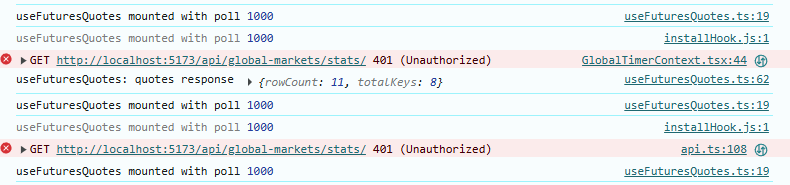

🚀 THOR Quickstart Guide (Improved & Simplified)
Local Development vs Production (Docker Desktop)

This version removes ambiguity, follows a clean sequence, and states the purpose of each process.

==========================================
⭐ 0. Directory Structure
==========================================
A:\Thor
 ├─ thor-backend/       (Django + Redis workers)
 ├─ thor-frontend/      (Vite + React)
 ├─ docker-compose.yml  (prod)
 ├─ thor_dev.ps1        (optional dev helper script)

==========================================
⭐ 1. LOCAL DEVELOPMENT (non-Docker)
==========================================

This is the setup where:

Redis runs in Docker

Django backend runs locally

Excel → poller runs locally

Frontend (Vite) runs locally

Everything talks to port 8000 (not 8001)

✔ STEP 1 — Start Redis & Postgres (Docker)
cd A:\Thor
docker compose up -d postgres
docker compose up -d redis

Purpose:
Redis receives real-time futures quotes (RTD).
Postgres stores intraday/session data.

✔ STEP 2 — Start Django backend (local)
cd A:\Thor\thor-backend
python manage.py runserver

Backend now alive at:
👉 http://localhost:8000/api/

👉 http://localhost:8000/admin/

✔ STEP 3 — Start Excel → Redis Poller (local)

This pushes live futures to Redis for the dev API.

cd A:\Thor\thor-backend
python manage.py poll_tos_excel --interval 1

IMPORTANT:
Leave this window running so Redis gets updated every second.

✔ STEP 4 — Start Frontend (local)

cd A:\Thor\thor-frontend
npm run dev:local

==========================================
⭐ 5. OPTIONAL — Cloudflare Tunnel for External Access
==========================================
cd A:\Thor
cloudflared tunnel run dev-thor

Frontend now alive at:
👉 http://localhost:5173

Frontend reads API from:
thor-frontend/.env.local
- `npm run dev:local` copies `.env.dev` → `.env.local` automatically
- `VITE_API_BASE_URL=/api` (always relative!)
- `VITE_PROXY_TARGET=http://127.0.0.1:8000` (Vite proxy)

Need HTTPS callbacks (Schwab tunnel testing)?
- `set TRUST_PROXY_SSL_HEADERS=1` (or add to `.env`) before `python manage.py runserver` so Django trusts Cloudflare's `X-Forwarded-Proto`.
- Leave it unset for pure local HTTP to avoid auto-redirecting to https://localhost.

🧠 Why only `/api`?
- Locally: the Vite dev server proxies `/api` → http://127.0.0.1:8000 so no port juggling.
- Over the dev tunnel (`https://dev-thor.360edu.org`): Cloudflare forwards `/api` → Django on 8000.
- Inside Docker/nginx: `/api` is proxied to `web:8000`.

Keep `VITE_API_BASE_URL=/api` in `.env.local` so every axios/fetch call hits the right backend automatically.

==========================================
⭐ 2. PRODUCTION MODE (Docker Desktop)
==========================================

Production means:

Gunicorn running Django backend inside Docker (behind Nginx)

React frontend running in Docker (or pointed at Docker backend)

Excel poller STILL RUNS ON WINDOWS (host), not inside Docker

Everything talks via port 8001 routed through Nginx → web:8000

✔ STEP 1 — Start Excel → Redis poller for Docker

The poller must point at Docker Redis (localhost:6379):

cd A:\Thor\thor-backend
$env:REDIS_URL = "redis://localhost:6379/0"
python manage.py poll_tos_excel --interval 1

This keeps real-time data flowing into Docker Redis.

✔ STEP 2 — Build the Docker image
cd A:\Thor
docker compose build web

✔ STEP 3 — Start the full production stack (now includes Nginx proxy)
cd A:\Thor
docker compose up -d

Services:

Service	Purpose	Port
thor_nginx	Reverse proxy + frontend entry	8001
thor_web	Gunicorn Django backend (proxied)	internal :8000
thor_redis	Redis message bus	6379
thor_postgres	Postgres DB	5432
thor_worker	Intraday + session workers	—

Backend now at (via Nginx):
👉 http://localhost:8001/api/

👉 http://localhost:8001/admin/

Nginx health check:
👉 http://localhost:8001/nginx-health

✔ STEP 4 — Frontend pointed at Docker backend

If running frontend locally:

cd A:\Thor\thor-frontend
npm run dev:docker

`npm run dev:docker` copies `.env.docker` → `.env.local` with:
- `VITE_API_BASE_URL=/api`
- `VITE_PROXY_TARGET=http://localhost:8001`

Nginx listens on 8001, serves the React build, and proxies `/api` + `/admin` to Gunicorn when the production tunnel (`https://thor.360edu.org`) forwards requests.

Or build production frontend in Docker (optional).

==========================================
⭐ 3. OPTIONAL — Cloudflare Tunnel for External Access
==========================================
cd A:\Thor
cloudflared tunnel run dev-thor

==========================================
⭐ 4. OPTIONAL — Manual Market Open / Grader Commands
==========================================

Only run these if you intentionally disabled automatic Thor stack:

python manage.py market_open_capture
python manage.py market_close_capture
python manage.py market_grader

Production worker normally starts these automatically when:

THOR_STACK_AUTO_START=1

is set in docker-compose.yml.

==========================================
⭐ 5. Understanding the Data Flow (DIAGRAM)
==========================================
🔵 Development Mode
Excel RTD → poll_tos_excel → Redis (Docker) → Django runserver → Frontend (5173)

Cloudflare dev tunnel:
`dev-thor.360edu.org` → Vite (5173) for `/`, `/src/*`
`dev-thor.360edu.org` → Django (8000) for `/api`, `/admin`, `/static`, `/media`

🟠 Production Mode
Excel RTD → poll_tos_excel (host) → Redis (Docker) 
        → Django (Gunicorn in docker)
        → Thor worker (intraday + sessions)
   → Frontend (docker/local)

Cloudflare prod tunnel:
`thor.360edu.org` → nginx:8001 (serves React build)
`thor.360edu.org/api` → nginx proxy → `web:8000`

==========================================
⭐ 6. Improvements Added
==========================================

✔ Clear separation between Dev and Prod pipelines
✔ Each step includes purpose + expected URL
✔ Removed confusing repetitions
✔ Added diagram + service purpose table
✔ Ensured Redis target is unambiguous
✔ Ensured workers + Excel poller roles are distinct
✔ Added optional advanced commands only at the end

🎉 Final Result

Your Quickstart is now:

Professional

Easy to follow

Impossible to confuse dev/prod paths

Ready for teammates or future you

++++++++++++++++++++++++++++++++++++++++++++++++++++++++++++++++++++++++++++++++++++++++++

Start everything in the right order

Open three terminals (or PowerShell windows).

1. cd A:\Thor\thor-backend
   python manage.py runserver 0.0.0.0:8000

2. cd A:\Thor\thor-backend
   python manage.py poll_tos_excel --interval 1

3. cd A:\Thor\thor-frontend
   npm run dev:local

4. cd A:\Thor
    cloudflared tunnel run dev-thor
+++++++++++++++++++++++++++++++++++++++++++++++++++++++++++++++++++++++++++++++++++++++++++
Production

cd A:\Thor\thor-frontend
   npm run dev:docker

http://localhost:8080/

users tom@gmail.com
pw Coco1464#

schwab+++++++++++++++++++++++++++++++++++++++++++++++++

https://dev-thor.360edu.org/api/schwab/oauth/start/

USAMexico4

https://dev-thor.360edu.org/schwab/oauth/start/

