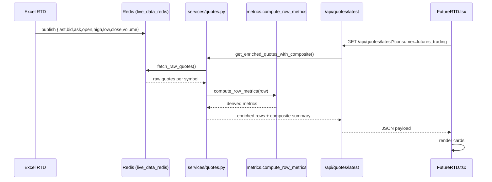
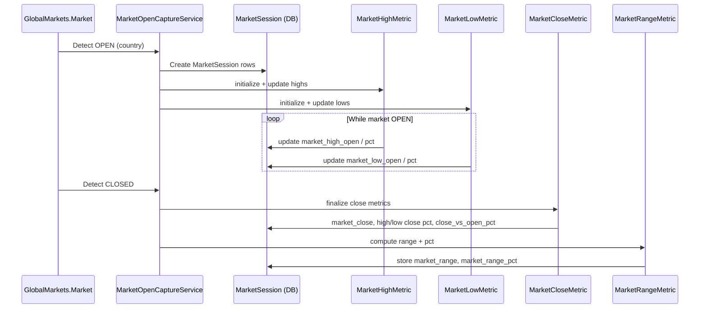
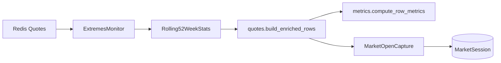
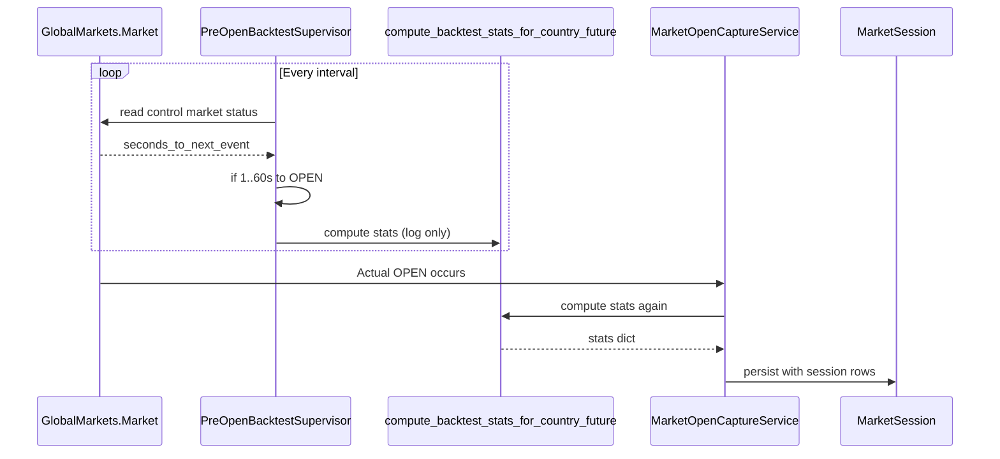

# Thor Metrics System — Dev Quick Reference

This cheat sheet gives developers instant answers:

- Where does a value come from?
- Which file computes a metric?
- Which metrics are live-only vs persisted?

Use this when working on the frontend cards, market sessions, or 52-week tracking.

---

## 🔥 DEV QUICK REFERENCE

### LIVE FRONTEND METRICS (NOT saved to DB)
Calculated per quote (in memory) for `/api/quotes/latest` and the dashboard.

| Metric | Meaning | Where Calculated | Notes |
|--------|---------|------------------|-------|
| `last_prev_diff` | last − previous close | `FutureTrading/services/metrics (compute_row_metrics)` | Live only |
| `last_prev_pct` | % change from previous close | `FutureTrading/services/metrics (compute_row_metrics)` | Shown as % Change |
| `open_prev_diff` / `open_prev_pct` | open vs previous close | `FutureTrading/services/metrics (compute_row_metrics)` |  |
| `high_prev_diff` / `high_prev_pct` | daily high vs previous close | `FutureTrading/services/metrics (compute_row_metrics)` |  |
| `low_prev_diff` / `low_prev_pct` | daily low vs previous close | `FutureTrading/services/metrics (compute_row_metrics)` |  |
| `range_diff` | high − low (intraday) | `FutureTrading/services/metrics (compute_row_metrics)` |  |
| `range_pct` | intraday range / previous close | `FutureTrading/services/metrics (compute_row_metrics)` |  |
| `spread` | ask − bid | `FutureTrading/services/metrics (compute_row_metrics)` |  |
| `last_52w_above_low_diff` / `last_52w_above_low_pct` | distance above 52w low | `FutureTrading/services/metrics (compute_row_metrics)` |  |
| `last_52w_below_high_diff` / `last_52w_below_high_pct` | distance below 52w high | `FutureTrading/services/metrics (compute_row_metrics)` |  |
| `extended_data.high_52w` / `extended_data.low_52w` | 52-week extremes added to row | `FutureTrading/services/quotes.build_enriched_rows` | Pulled from DB |

➡️ Frontend should consume these directly (no re‑calculation in components).

---

### INTRADAY SESSION METRICS (Persisted in `MarketSession`)
Calculated and written during each control market's open/close lifecycle.

| DB Column | Meaning | Where Calculated | When |
|-----------|---------|------------------|------|
| `market_open` | price at open | `MarketOpenMetric.update` | Immediately at open |
| `market_high_open` | highest price seen while open | `MarketHighMetric.update_from_quotes` | During session |
| `market_high_pct_open` | % move from open → intraday high | same | During session |
| `market_low_open` | lowest price seen while open | `MarketLowMetric.update_from_quotes` | During session |
| `market_low_pct_open` | % up from low | same | During session |
| `market_close` | last price at close | `MarketCloseMetric.update_for_country_on_close` | At close |
| `market_high_pct_close` | % below intraday high at close | same | At close |
| `market_low_pct_close` | % above intraday low at close | same | At close |
| `market_close_vs_open_pct` | (close − open) / open * 100 | same | At close |
| `market_range` | intraday high − low | `MarketRangeMetric.update_for_country_on_close` | After close |
| `market_range_pct` | intraday range / open * 100 | same | After close |

➡️ Long‑lived analytics; appear in Django Admin and backtests.

---

### 52-WEEK EXTREMES

| Value | Meaning | Where Updated |
|-------|---------|---------------|
| `Rolling52WeekStats.high_52w` | rolling 52w high | `Week52Supervisor._ExtremesMonitor` |
| `Rolling52WeekStats.low_52w` | rolling 52w low | `Week52Supervisor._ExtremesMonitor` |
| `extended_data.high_52w`, `extended_data.low_52w` | injected into quote rows | `services/quotes.build_enriched_rows` |
| `low_pct_52w`, `high_pct_52w`, `range_52w`, `range_pct_52w` | stored at market open | `MarketOpenCapture` |

➡️ Monitor runs when ANY control market is open; feeds live & session metrics.

---

### PRE-OPEN BACKTEST METRICS

| Metric Source | Description | Where Computed |
|---------------|-------------|----------------|
| Backtest stats | Buy / Strong Buy / Sell success metrics | `services/backtest_stats.compute_backtest_stats_for_country_future` |
| Pre-open warm-up | Run 1–60s before market OPEN (log only) | `PreOpenBacktestSupervisor` |
| Persisted stats | Saved with each `MarketSession` row | `MarketOpenCapture.create_session_for_future` / `create_session_for_total` |

➡️ Same function runs twice (once for warm-up logging, once for persistence).

---

## Separation of Responsibility

- `services/metrics` (package) → Live / transient per‑row math (`compute_row_metrics`)
- `services/quotes.py` → Builds enriched rows + composite totals
- `Week52Supervisor.py` → Updates rolling 52w highs/lows (DB)
- `services/market_metrics.py` → Intraday session math (persisted)
- `MarketOpenCapture.py` → Creates `MarketSession` rows & triggers session metrics
- `PreOpenBacktestSupervisor.py` → Pre-open warm-up backtests (logs only)

---

# Thor Metrics Architecture (Full Documentation)

This document explains how all numeric and derived metrics in Thor are wired together:

- Source path (Excel RTD → Redis → Django)
- Live metrics for the frontend
- Intraday metrics persisted in `MarketSession`
- 52-week extremes tracking and usage
- Pre-open backtest integration

It also clarifies role boundaries:

- `FutureTrading/services/metrics` (package) → live frontend math
- `FutureTrading/services/market_metrics.py` → intraday DB session math

---

## 1. High-Level Data Flow

```mermaid
flowchart LR
    subgraph ExcelRTD[Excel RTD Workbook]
        RTDFeed[TOS RTD LiveData\n(A1:N13)]
    end

    subgraph RedisLayer[Redis]
        Quotes[Latest Quotes per Symbol]
    end

    subgraph DjangoBackend[Django Backend]
        Poller[poll_tos_excel\n(management command)]
        QuotesSvc[services/quotes.py\n(fetch_raw_quotes + build_enriched_rows)]
        MetricsSvc[services/metrics (package)\ncompute_row_metrics]
        MarketMetrics[services/market_metrics.py\nopen/high/low/close/range]
        Week52Sup[Week52Supervisor.py\n52w monitor + supervisor]
        PreOpenSup[PreOpenBacktestSupervisor.py]
        MarketOpenCap[MarketOpenCaptureService\n(MarketOpenCapture.py)]
        API[/GET /api/quotes/latest\n(+ /api/vwap/rolling)/]
    end

    subgraph Frontend[React Frontend]
        FutureRTD[FutureRTD.tsx\n+ useFuturesQuotes hook]
    end

    RTDFeed -->|poll_tos_excel| RedisLayer
    RedisLayer -->|get_latest_quote| QuotesSvc
    QuotesSvc --> MetricsSvc
    QuotesSvc -->|enriched_rows + composite| API
    API --> FutureRTD

    RedisLayer --> Week52Sup
    Week52Sup --> RollingStats[(Rolling52WeekStats\nDB)]

    RedisLayer --> PreOpenSup
    PreOpenSup -->|compute_backtest_stats| MarketOpenCap

    QuotesSvc --> MarketOpenCap
    MarketOpenCap --> MarketMetrics
    MarketOpenCap --> MarketSession[(MarketSession\nDB)]
```

Key idea:

Frontend uses enriched rows computed on the fly (no DB writes).

`MarketSession` stores intraday metrics for each market open session.

`Rolling52WeekStats` tracks long-term 52-week extremes per symbol.

---

## 2. Live Quote Enrichment (metrics package)

### 2.1 Purpose
`FutureTrading/services/metrics` is a package exposing `compute_row_metrics` used during quote enrichment.
Operates on in‑memory dicts. No database writes.

### 2.2 Data Flow for Live Metrics



### 2.3 What `compute_row_metrics` Does

Inputs (if present): `last|price`, `open_price`, `previous_close`, `high_price`, `low_price`, `bid`, `ask`, `extended_data.high_52w`, `extended_data.low_52w`.

Derivations:
- Differences: last vs prev close, open vs prev close, high vs prev close, low vs prev close, range, spread
- Percentages: diff / prev close * 100 (where prev close > 0)
- 52w distances: above low, below high (raw + %)

Returns a dict merged into the row used by `/api/quotes/latest`.

---

## 3. Intraday Session Metrics (`services/market_metrics.py`)

### 3.1 Purpose
Maintain per‑session (country market open) price evolution in `MarketSession` for 11 futures + TOTAL.

### 3.2 Session Lifecycle



### 3.3 Metric Roles
- High metric: only advances when a new high occurs.
- Low metric: only advances when a new low occurs.
- Close metric: snapshot + relative positions to high/low/open.
- Range metric: derived after market close.

---

## 4. 52-Week Extremes (`Week52Supervisor.py` + `Rolling52WeekStats`)

### 4.1 Purpose
Track rolling highs/lows for each normalized symbol (YM, ES, NQ, RTY, CL, SI, HG, GC, VX, DX, ZB) and expose to live enrichment + sessions.

### 4.2 Architecture


Behavior:
- First tick: initialize high_52w & low_52w.
- Subsequent ticks: update via `update_from_price`.
- Exposed to frontend through enriched rows.

---

## 5. Pre-Open Backtest Supervisor

### 5.1 Purpose
Run lightweight backtest stats shortly before market OPEN (cache warm‑up + logs) without writing sessions early.

### 5.2 Flow


---

## 6. Where Metrics Surface

### 6.1 Frontend
`GET /api/quotes/latest?consumer=futures_trading` returns enriched rows (includes metrics + 52w + VWAP). Consumed by `FutureRTD.tsx` and cards.

### 6.2 Django Admin
`MarketSessionAdmin` presents open/high/low/close/range/52w columns. `Rolling52WeekStatsAdmin` shows long‑term extremes & staleness.

---

## 7. Summary Matrix

| Layer | File / Component | Responsibility |
|-------|------------------|---------------|
| Excel → Redis | `poll_tos_excel` mgmt command | Stream RTD sheet to Redis |
| Live enrichment | `services/quotes.py` + `services/metrics (package)` | Build enriched rows + live per‑row math |
| Frontend | `FutureRTD.tsx`, `useFuturesQuotes` | Poll & render metrics, VWAP |
| 52w monitor | `Week52Supervisor.py` | Maintain rolling highs/lows |
| Market open capture | `MarketOpenCaptureService` | Create `MarketSession` rows |
| Intraday session math | `services/market_metrics.py` | Persist open/high/low/close/range |
| Pre-open backtests | `PreOpenBacktestSupervisor.py` | Warm-up backtest stats |

Key separation: **frontend/live math** vs **persisted session math**.

---

## 8. Implementation Guidelines

1. Prefer adding new transient quote-derived metrics in `services/metrics.compute_row_metrics`.
2. Persist only session lifecycle metrics (open/high/low/close/range) in `market_metrics`.
3. Never recompute backend metrics in React — consume the API payload directly.
4. When adding 52w dependent logic, update `Rolling52WeekStats` and expose via `quotes.build_enriched_rows`.
5. Backtest expansions: extend `compute_backtest_stats_for_country_future` (keeps warm-up and open capture aligned).

---

## 9. Future Enhancements (Ideas)

| Idea | Benefit |
|------|---------|
| Cache enriched rows for 250ms | Reduce duplicate computation under rapid polling |
| Introduce WebSocket push | Lower latency vs polling |
| Add anomaly flags (e.g., volume spike) | Real-time trade decision support |
| Persist VWAP snapshots per session | Session-level VWAP analytics |
| Add rolling volatility metric | Enhance risk scoring and signals |

---

## 10. Glossary

- **Enriched Row**: Raw quote + computed metrics + 52w + VWAP.
- **Session**: Continuous open period for a control market.
- **Control Market**: Country-level market whose open triggers a capture.
- **Backtest Stats**: Historical performance aggregates injected at session start.

---

End of Metrics Documentation.
